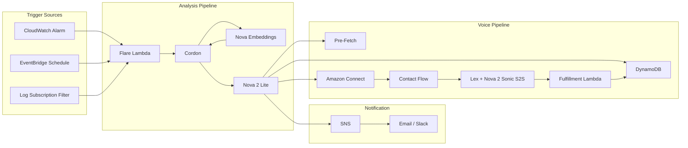
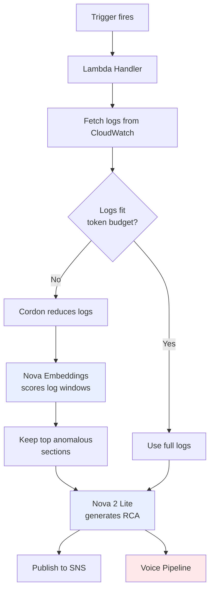
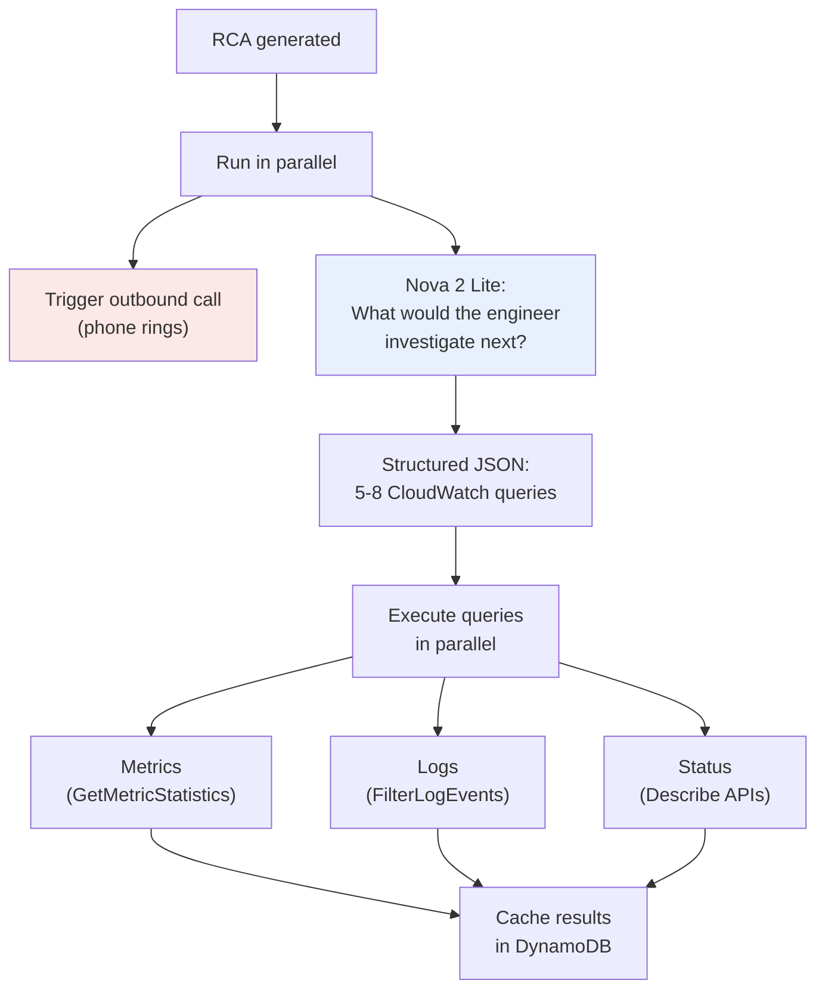
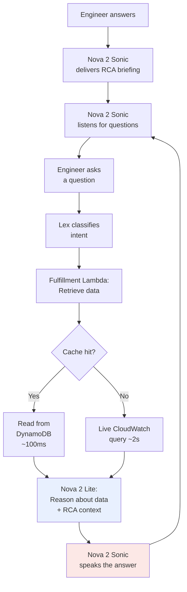
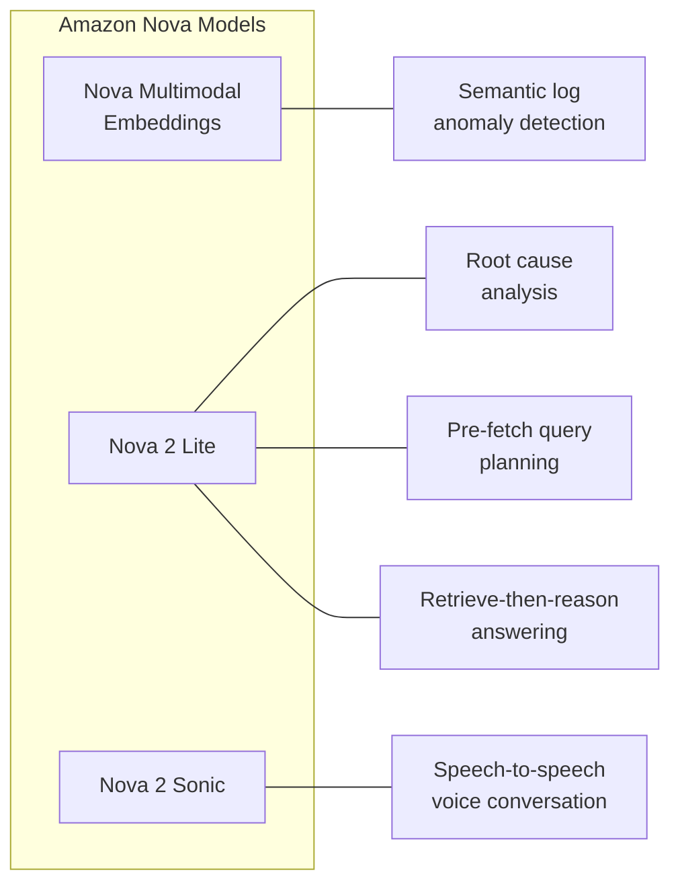
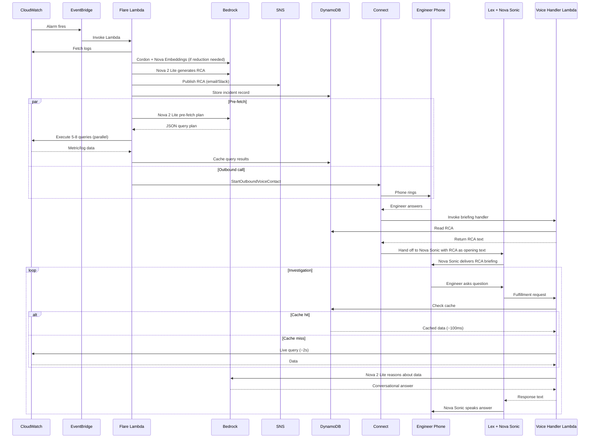
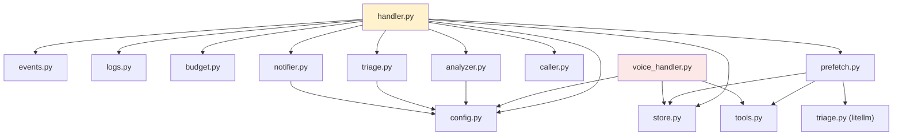
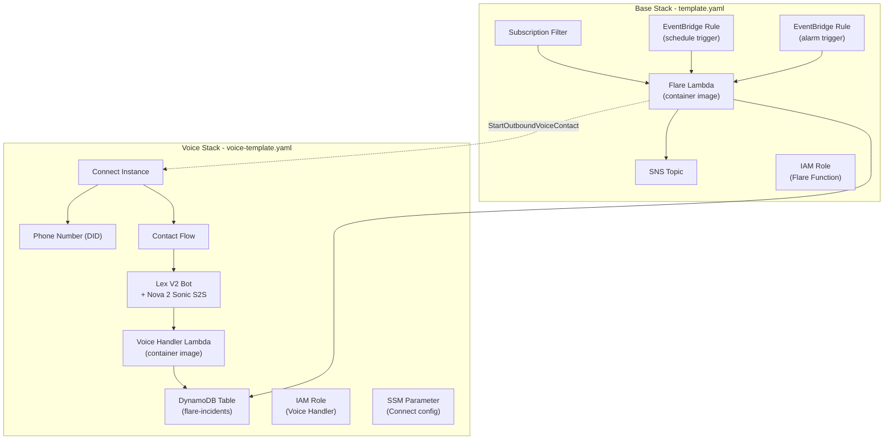

# Flare Architecture

Flare is a voice-driven triage assistant that autonomously analyzes AWS CloudWatch logs and calls the on-call engineer with a root cause analysis and interactive investigation tools. It is powered by three Amazon Nova foundation models working together across a serverless AWS pipeline.

---

## System Overview



---

## The Three Pipelines

Flare has three distinct pipelines that work in sequence.

### Pipeline 1: Log Analysis

Turns raw CloudWatch logs into a structured root cause analysis.



**How Cordon works**: When logs exceed the token budget, Cordon uses a sliding window approach. Each window of log lines is embedded using Nova Multimodal Embeddings, then scored for anomaly using k-nearest-neighbor density estimation. Windows with low density (semantically unusual compared to their neighbors) are flagged as anomalous. The anomaly percentile threshold is calculated dynamically to hit the target token budget.

**Token budget planner**: For multiple log groups, budget is allocated via greedy fair-share. Small groups that fit within their share keep full logs. Remaining budget is distributed proportionally among groups that need reduction.

### Pipeline 2: Predictive Pre-Fetch

Anticipates what the engineer will ask and caches the answers before they pick up the phone.



**Timeline**: The pre-fetch and outbound call happen concurrently. Nova Lite returns a pre-fetch plan in ~3 seconds. The CloudWatch queries execute in parallel and complete in ~5-8 seconds. Meanwhile, the phone is ringing (15-30 seconds). By the time the engineer answers, the investigation data is already cached.

**Pre-fetch prompt**: Nova 2 Lite receives the RCA and alarm context and returns a structured JSON object listing the specific CloudWatch metrics (namespace, metric name, dimensions), log queries (log group, filter pattern), and resource status checks it recommends. It focuses on resources mentioned in the RCA plus 1-2 adjacent resources.

### Pipeline 3: Voice Conversation

Delivers the RCA by phone and supports interactive investigation using Nova 2 Sonic speech-to-speech and a retrieve-then-reason pattern. All voice output goes through Nova Sonic -- no separate TTS engine is used.



**Retrieve-then-reason**: The fulfillment Lambda does not format raw metric data into canned responses. Instead, it pulls the relevant data (from cache or live), then passes the engineer's original question, the data, and the full RCA context to Nova 2 Lite. The LLM generates a natural, analytical answer. This means subjective questions like "does it look like the database is overwhelmed?" get intelligent answers that correlate metrics with the incident context.

**FallbackIntent**: Questions that don't match a specific Lex intent are routed to the FallbackIntent, which sends ALL cached data to Nova 2 Lite and lets it figure out what's relevant. This makes the conversation feel open-ended rather than constrained to predefined queries.

---

## Amazon Nova Model Usage

Flare uses three Nova foundation models, each for a distinct purpose:



| Model | ID | Purpose | Where Used |
|-------|-----|---------|------------|
| Nova Multimodal Embeddings | `amazon.nova-2-multimodal-embeddings-v1:0` | Embeds log windows for semantic anomaly scoring | `analyzer.py` via Cordon |
| Nova 2 Lite | `us.amazon.nova-2-lite-v1:0` | Text reasoning (RCA, pre-fetch planning, follow-up answers) | `triage.py`, `prefetch.py`, `voice_handler.py` |
| Nova 2 Sonic | `amazon.nova-2-sonic-v1:0` | Real-time speech-to-speech conversation | Amazon Connect via Lex V2 |

---

## Data Flow

This diagram shows the complete data flow from alarm to voice conversation, including what data is stored and where.



---

## Module Map

```
src/flare/
  handler.py          Orchestrates the full pipeline (entry point)
  config.py           Configuration from environment variables
  events.py           Parses alarm / schedule / subscription triggers
  logs.py             Fetches and resolves CloudWatch Log groups
  budget.py           Token budget planner (fair-share allocation)
  analyzer.py         Cordon integration for log reduction
  triage.py           Nova 2 Lite RCA generation
  notifier.py         SNS notification publishing
  store.py            DynamoDB incident storage (put/get/update cache)
  caller.py           Amazon Connect outbound call trigger
  prefetch.py         Predictive pre-fetch (plan + execute + cache)
  tools.py            CloudWatch query tools (metrics, logs, status)
  voice_handler.py    Voice Lambda handlers (briefing + fulfillment)
  prompts/
    triage.txt        System prompt for RCA generation
    prefetch.txt      Prompt for pre-fetch query planning
    voice_system.txt  System prompt for Lex/Nova Sonic persona
    reasoning.txt     System prompt for retrieve-then-reason step
```

### Module Dependencies



The handler (`handler.py`) is the entry point. It calls modules left-to-right through the pipeline. The voice handler (`voice_handler.py`) is a separate Lambda entry point, called by Amazon Connect and Lex.

---

## Infrastructure

### AWS Resources



The system uses two CloudFormation stacks:

**Base stack** (`template.yaml`, deployed via `make deploy`): Flare analysis Lambda, SNS topic, EventBridge rules, subscription filter, IAM roles. This handles log analysis and notification independently of the voice layer.

**Voice stack** (`voice-template.yaml`, deployed via `make deploy-voice`): Voice handler Lambda, DynamoDB table, Amazon Connect instance, phone number, contact flow, Lex V2 bot with Nova 2 Sonic S2S, IAM roles, and an SSM parameter that passes Connect configuration back to the base stack. Nova Sonic is configured via post-deploy CLI commands in the Makefile (CloudFormation cannot set `UnifiedSpeechSettings` and `VoiceSettings` in the same update).

Both stacks use the same container image from private ECR. Teardown with `make teardown-all`.

### DynamoDB Schema

```
Table: flare-incidents-{stack-name}
Primary Key: incident_id (String, UUID)

Attributes:
  rca              String    Full RCA text from Nova 2 Lite
  alarm_name       String    CloudWatch alarm name
  alarm_reason     String    Alarm state change reason
  log_groups       List      Log group names from config
  trigger_type     String    alarm | subscription | schedule
  timestamp        String    ISO 8601
  ttl              Number    Epoch seconds (7-day expiry)
  prefetch_status  String    pending | complete | failed
  cached_data      String    JSON blob containing:
    metrics[]        query_key, namespace, metric_name, dimensions, datapoints
    logs[]           query_key, log_group, filter_pattern, event_count, sample_lines
    status[]         query_key, resource_type, resource_id, health, details
```

Each cached item includes a `query_key` -- a human-readable label like "RDS connections for auth-db" used for fuzzy matching against the engineer's question.

---

## Timing

This diagram shows the typical timing of an end-to-end incident response, from alarm to first answered question.

```
t=0s    CloudWatch Alarm fires
t=1s    EventBridge delivers event to Flare Lambda
t=1-5s  Lambda fetches logs from CloudWatch
t=5-8s  Cordon + Nova Embeddings reduces logs (if needed)
t=8-12s Nova 2 Lite generates RCA
t=12s   SNS notification sent (email/Slack)
        ┌──────────────────────────────────────────────┐
t=12s   │ PARALLEL:                                    │
        │                                              │
        │ Thread 1: Outbound call                      │
        │   t=12s  StartOutboundVoiceContact           │
        │   t=13s  Phone starts ringing                │
        │   t=25s  Engineer answers                    │
        │   t=26s  Nova Sonic delivers RCA briefing    │
        │   t=40s  "What would you like to know?"      │
        │                                              │
        │ Thread 2: Pre-fetch                          │
        │   t=12s  Nova 2 Lite generates pre-fetch plan│
        │   t=15s  Execute 5-8 CloudWatch queries      │
        │   t=20s  Cache populated in DynamoDB         │
        │                                              │
        └──────────────────────────────────────────────┘
t=42s   Engineer asks first question
t=42.1s DynamoDB cache read (~100ms)
t=44s   Nova 2 Lite reasons about data (~2s)
t=45s   Nova 2 Sonic speaks the answer

Total: alarm-to-answer in ~45 seconds
```

The pre-fetch completes ~5 seconds before the engineer finishes hearing the RCA briefing, so cached data is always ready for the first question.

---

## Error Handling

| Failure | Impact | Fallback |
|---------|--------|----------|
| Nova Sonic unavailable / Lex error | Voice conversation fails | Contact flow disconnects. SNS notification already sent as fallback. |
| Connect call fails (no answer) | Engineer not reached by phone | SNS email/Slack is the primary channel; voice is supplementary. |
| Fulfillment Lambda timeout (8s) | One question unanswered | Catches exception, returns "I ran into an issue, try asking again." |
| DynamoDB read failure | No RCA for briefing | Briefing Lambda returns generic "incident detected, check your email" message. |
| Pre-fetch fails | No cached data | Fulfillment Lambda falls back to live CloudWatch queries with 5-second timeout. |
| Nova 2 Lite reasoning fails | Raw data instead of analysis | Catches exception, returns a basic data summary rather than LLM-generated answer. |
| Cordon / embeddings fail | No log reduction | Falls back to truncating logs to fit token budget. RCA still generated from partial data. |

The system is designed so that every failure path still results in the engineer receiving the RCA -- if not by voice, then by email.

---

## Security

- **Read-only operations**: The voice pipeline only reads CloudWatch metrics, logs, and resource status. No remediation actions are taken. This is by design and framed as a safety feature.
- **IAM least-privilege**: The Flare Lambda role has write access to DynamoDB and Connect outbound call only. The Voice Handler role has read access to DynamoDB and CloudWatch only. Neither role can modify infrastructure.
- **Data retention**: Incident records in DynamoDB have a 7-day TTL. No long-term storage of log data or conversation transcripts.
- **Phone number scope**: Only the configured on-call phone number receives calls. The number is set via an environment variable, not hardcoded.
